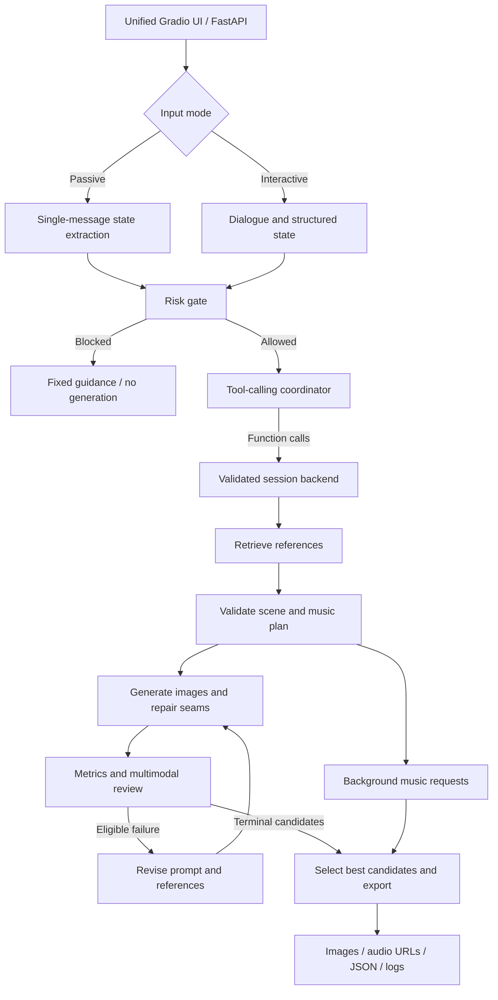

<div align="center">

# VR Scene Agent

**Tool-calling orchestration for personalized panoramic scenes and music.**

Turn a short conversation or a single description into a structured scene plan, retrieve visual references, generate panoramic images, and refine candidates through multimodal review.


[Overview](#overview) · [Architecture](#architecture) · [Quick Start](#quick-start) · [Tools](#tool-registry) · [Testing](#testing-and-evaluation) · [Limitations](#limitations)

</div>

---

## Overview

VR Scene Agent is a research prototype for generating personalized natural-environment content for VR relaxation experiences. It combines an LLM tool-calling coordinator, a reference-image retrieval pipeline, diffusion-based panorama generation, music generation, and an iterative image-review process.

The coordinator chooses registered tools and scene batches through function calls. A session backend validates each action, owns the generated artifacts, and enforces dependencies and retry limits. The model can decide which eligible scenes to process next; it cannot fabricate review results, bypass risk checks, or execute arbitrary code.

Two input modes share one interface:

| Mode | Interaction |
|---|---|
| **Passive** | Describe preferences in one message. The system extracts structured state before generation. |
| **Interactive** | Refine preferences through a short dialogue, then generate from the collected state. |

The output includes scene images, audio URLs, scene durations, review results, and configuration fields intended for a Unity client. **A Unity client is not included.**

> **Project status:** The refactor has passed 19 offline tests using service fixtures. Live LLM, GPU, Chroma, music-service, and browser end-to-end validation remains pending. Required reference assets and local model statistics are not bundled.

## Highlights

- **Model-directed tool calling** — Eight registered tools exposed through LiteLLM's `tools` / `tool_calls` interface, with Pydantic argument validation.
- **Reference-grounded planning** — Chroma retrieval over image descriptions, with estimated-color-temperature filtering and rule-based reranking.
- **Reference-conditioned generation** — SDXL with ControlNet and optional IP-Adapter image conditioning, followed by panorama seam repair.
- **Iterative review** — Multimodal review combines generated images, user preferences, and image metrics. Failed scenes can be revised within a bounded budget.
- **Best-candidate retention** — Keep the highest-ranked audited candidate instead of assuming the final attempt is the best.
- **One interface** — Passive and Interactive modes, model selection, a scene gallery, audio playback, and JSON output in one Gradio application.
- **Inspectable execution** — Session-isolated artifacts, tool traces, coordinator usage records, and offline evaluation utilities.

## Architecture



The diagram shows the task dependencies. It is not a hard-coded tool-selection sequence: the coordinator chooses calls and batches, while the backend rejects actions whose prerequisites are unmet.

### Agent execution

`ToolAgent.py` sends a stable system prompt, tool schemas, recent complete tool exchanges, and a current backend snapshot to the coordinator model. It then:

1. Reads the model's function calls.
2. Validates names, arguments, and call IDs.
3. Dispatches registered operations to the session backend.
4. Returns tool results with their matching `tool_call_id`.
5. Continues until the session is finalized or a decision/call budget is exhausted.

Dialogue collection remains a user-driven preparation stage. Risk checks and execution constraints are enforced in code rather than delegated to model discretion.

### Retrieval and planning

The reference pipeline uses one record per image:

```text
Reference image
  → GPT-4o semantic description + computed image metadata
  → text-embedding-3-small
  → local persistent Chroma collection
```

`Extraction_Database.py` provides the indexing utility. Image descriptions are stored as documents, while filenames and computed attributes are stored as metadata. The actual images remain on disk.

At generation time, the pipeline:

- Retrieves up to **5 global references** for planning.
- Generates a schema-validated plan containing **10 unique scene steps** and **2 music entries**.
- Retrieves up to **3 candidates per scene** using that scene's image prompt.
- Applies an estimated-Kelvin metadata filter, with a dense-retrieval fallback if filtering fails or returns no matches.
- Reranks candidates using vector distance plus a target-Kelvin deviation penalty.

The image generator currently uses the **first valid reference image** for IP-Adapter conditioning. This is text-description retrieval followed by image conditioning, not direct CLIP retrieval, BM25 hybrid search, or multi-reference image fusion.

### Generation and review

The generation module retains SDXL, a depth ControlNet with a procedurally constructed control image, optional local LoRA loading, and optional IP-Adapter reference conditioning. The control image is **not** a depth map estimated from the retrieved reference.

Panorama handling includes horizontal circular padding and seam inpainting: the image is rolled horizontally to move its boundary to the center, the seam region is repaired, and the image is rolled back. Progressive high-resolution generation and PhotoFinisher postprocessing are also retained.

Review uses the generated image, user state, scene data, and supporting metrics:

| Signal | Meaning in this implementation |
|---|---|
| DS score | A score derived from color and gradient differences at the horizontal seam. |
| MD score | A transformed Mahalanobis-distance score using VAE features, PCA, and local reference statistics. |
| Image attributes | Estimated Kelvin, brightness, contrast, and other image-derived measurements. |
| Semantic alignment | Cosine similarity between scene-prompt and strategy **text** embeddings. |

Failed scenes can receive up to **3 refinement retries** by default. Repeated critiques trigger a strategy-change instruction and an attempt to change the reference. Candidate selection prioritizes PASS status, available quality signals, and Kelvin proximity.

## Quick Start

### 1. Prepare the environment

Start from an environment that already runs the original image-generation pipeline when possible. From the repository root, install the application-layer dependencies:

```bash
python -m pip install -r requirements-agent.txt
```

For a new environment, provision the GPU-compatible PyTorch build and the full dependencies in [`requirements.txt`](requirements.txt). The file includes a CUDA installation example. The complete dependency combination has not been revalidated in a clean GPU environment during this refactor.

The full pipeline requires a suitable CUDA environment: some retained metric-model code defaults to CUDA. A CPU-only end-to-end setup is not validated.

### 2. Supply the project assets

Place the existing assets alongside the Python files:

```text
PictureData/                  # Original reference images matching indexed filenames
PictureBase/                  # Chroma database with nature_environments collection
models/
├── real_pano_mu.npy           # Reference feature mean
├── real_pano_inv_cov.npy      # Inverse covariance
├── pca.pkl                   # Matching fitted PCA object
└── lora/
    └── Custome.safetensors    # Optional local LoRA weights; spelling matches the code
```

These assets are not distributed with the source. Generation and metric models may also require downloads or local Hugging Face caches. For a new reference database, inspect `Extraction_Database.py`, configure its `API_KEY`, and run it against your reference images. This indexing step calls an external model and does not create the PCA/reference statistics above.

### 3. Configure credentials

Copy `.env.example` to `.env` and fill the credentials for your selected services:

```dotenv
LLM_MODEL=gpt-5.4
OPENAI_API_KEY=your-key
CHROMA_OPENAI_API_KEY=your-embedding-key
SUNO_API_KEY=your-music-service-key
SUNO_API_BASE=your-compatible-music-service-base-url
HF_TOKEN=your-hugging-face-token
```

`CHROMA_OPENAI_API_KEY` falls back to `OPENAI_API_KEY` in the generation backend. Music integration expects a service implementing the `/generate` and `/generate/record-info` contract used in `Production_Agent.py`; an arbitrary audio API is not interchangeable.

Keep `.env` and private session logs out of Git. Model names are configuration defaults, not a guarantee of access or compatibility with every provider route.

### 4. Launch

Run from the repository root so the relative asset paths resolve correctly:

```bash
python UnifiedApp.py
```

Open **[http://127.0.0.1:8000/gui](http://127.0.0.1:8000/gui)**.

Choose Passive or Interactive, enter your preferences, and generate. The current interface uses Chinese labels. Switching the input mode or selected model clears previous conversation state and outputs.

The legacy `AgentAPP_Interactive.py` and `AgentAPP_Passive.py` commands both launch this same application. Run only one entry point.

## Tool Registry

Schemas are defined in [`ToolAgent.py`](ToolAgent.py) and provided as a readable snapshot in [`TOOL_SCHEMAS.json`](TOOL_SCHEMAS.json).

| Tool | Arguments | Responsibility |
|---|---|---|
| `retrieve_context` | None | Retrieve global references from stored user state. |
| `plan_session` | None | Generate and validate the plan; attach scene references. |
| `start_music` | None | Start the two planned music requests in background workers. |
| `generate_scenes` | `steps: int[]` | Generate selected initial scenes and repair seams. |
| `audit_scenes` | `steps: int[]` | Measure and review selected pending candidates. |
| `refine_scenes` | `steps: int[]` | Revise and regenerate eligible failed scenes. |
| `inspect_session` | None | Read authoritative session progress. |
| `finish_session` | None | Save best candidates, postprocess, await music, and export. |

Scene IDs must be unique integers from 1 through 10. Unknown tools, extra parameters, invalid IDs, premature finalization, and retries beyond the configured limit are rejected. No shell execution or model-supplied filesystem paths are exposed as tools.

## Context and Execution Design

### Compact coordinator context

Full plans, image data, references, and artifacts stay in the backend. The coordinator receives scene IDs, statuses, retry counts, and shortened review feedback. It retains the last **four complete assistant/tool exchange groups**, followed by an authoritative state snapshot, so history trimming does not leave orphaned tool messages.

The system prompt and tool-schema order remain stable to support provider-side prefix reuse. An optional `AGENT_PROMPT_CACHE_KEY` can be passed through a verified compatible route. Provider usage fields are recorded when returned.

**This is not a custom KV-cache implementation.** Hosted providers manage their own cache internals. History trimming and long-prefix reuse involve a tradeoff, and cache hits or latency improvements have not been benchmarked here.

### Background I/O and GPU ownership

Music calls run in background threads. Synchronous image-generation work also runs off the event loop, allowing music I/O to overlap GPU work after `start_music` is called.

Model initialization, generation, seam repair, metric inference, and postprocessing use a shared file lock for GPU access. Cancellation waits for active worker ownership to be released safely; it does not assume cancelling an asyncio task stops its underlying thread. UI mutations share a serialized queue, while API requests can progress through independent non-GPU stages.

Additional coordinator calls add overhead. This design enables model-directed execution and inspection; it does not guarantee lower latency than a fixed workflow.

## Configuration

See [`.env.example`](.env.example) for the full configuration template.

| Variable | Default | Purpose |
|---|---|---|
| `LLM_MODEL` | `gpt-5.4` | Default model selected in the UI. |
| `LLM_MODELS` | Built-in model list | Comma-separated selectable model names; the default model is also included. |
| `AGENT_MODEL` | Selected model | Optional separate tool-calling coordinator. |
| `APP_HOST` / `APP_PORT` | `127.0.0.1` / `8000` | Local application address. |
| `AGENT_MAX_TURNS` | `64` | Coordinator decision limit. |
| `AGENT_MAX_CALLS` | `96` | Tool-call limit per run. |
| `AGENT_MAX_OUTPUT_TOKENS` | `1800` | Output-token limit per coordinator response. |
| `MAX_AUDIT_RETRIES` | `3` | Refinement retries per failed scene. |
| `AUTO_RUN_UPSCALE` | `1` | Enable final PhotoFinisher processing. |
| `AGENT_PROMPT_CACHE_KEY` | Unset | Optional provider-specific prompt-cache routing hint. |
| `RESULTS_ROOT` | `static/results` | Output root; keep under `static` for URL compatibility. |
| `SESSION_LOG_JSONL` | `static/results/session_logs.jsonl` | Append-only session records. |
| `GPU_LOCK_FILE` | Temporary-directory lock file | Shared lock location for cooperating processes. |

Call and token limits are not a hard total-cost or wall-clock budget. Coordinator usage is logged separately; specialist-model usage is not yet aggregated into a full session cost.

## API and Outputs

### Create a session

Send a request to `POST /generate-session`:

```json
{
  "mode": "passive",
  "description": "I feel mentally tired and would like a warm, open lakeside environment without crowds.",
  "model_name": "gpt-5.4"
}
```

For Interactive mode, use `"mode": "interactive"` and supply a collected `dialog_state`; the UI handles dialogue collection.

The response contains `session_id` and `data`. Important result fields include:

| Field | Contents |
|---|---|
| `intervention_plan` | Scene resources, duration, quality metrics, review status, seed, and `unity_config`. |
| `music_playlist` | Music titles and audio URLs, including fallback URLs when needed. |
| `status` | `Success`, `Partial`, or `blocked_risk` for returned session outcomes. |
| `missing_steps` | Planned scene IDs absent from the final generated output. |
| `metrics_stage` | Identifies metrics as preceding final photo enhancement. |

`Success` requires all ten exported scenes to pass image review; it does not prove therapeutic benefit or successful generation of original music rather than fallback audio. `Partial` indicates missing scenes or retained candidates that did not pass. An all-image-failure or unrecoverable execution error raises an error instead of returning successful output.

### Retrieve a retained result

```text
GET /get-latest-session?session_id=<session_id>
```

Despite the legacy route name, an explicit ID is required. The application retains up to 32 ordinary completed results in memory; the risk-blocked early-return path is written to disk but is not added to this lookup.

### Inspect artifacts

```text
static/results/
├── session_logs.jsonl
└── passive/ or interactive/
    └── <session_id>/
        ├── base/
        ├── audit/
        ├── final_images/
        ├── seam_retry/
        ├── upscale_input/
        ├── upscale_output/
        └── session.json
```

`session.json` records results, tool calls, arguments, errors, timings, and coordinator usage. It supports inspection, not checkpoint-based restart. Session logs contain user-provided information and should not be published as sample data without review.

## Testing and Evaluation

Run the offline tests from the repository root:

```bash
python -m unittest discover -s tests -v
python -m compileall -q .
```

The recorded validation run passed **19 tests** covering state/risk rules, schemas, session isolation, tool dispatch, tool-message pairing, scene batching, retry limits, best-candidate restoration, partial outputs, background overlap, and cancellation/lock behavior. See [`VALIDATION.txt`](VALIDATION.txt).

The orchestration tests execute the real coordinator and backend against simulated model, image, music, and review services. They do not establish live provider compatibility, visual quality, browser behavior, or clinical effectiveness.

Evaluate collected session records with:

```bash
python evaluate_sessions.py static/results/session_logs.jsonl
```

Optional labels can be supplied:

```bash
python evaluate_sessions.py static/results/session_logs.jsonl \
  --audit-labels audit_labels.csv \
  --retrieval-golden retrieval_golden.jsonl
```

- `audit_labels.csv` requires `human_decision` and `model_decision` columns.
- Retrieval records require `expected_references` and `retrieved_references` arrays. Fix the returned-list length before reporting a specific Recall@K.
- The legacy pass-rate aggregation does not require ten returned scenes. Inspect completeness separately before interpreting a session pass rate.

No labeled retrieval benchmark, human-review agreement score, or before/after performance result is included.

## Project Structure

```text
UnifiedApp.py             Unified web UI and API
ToolAgent.py              Tool schemas, model loop, bounded context, traces
AgentBackend.py           Session state, tool execution, GPU ownership, export
PassiveState.py           Single-message state extraction
DialogTherapistAgent.py   Dialogue-based preference collection
StateManager.py          Dialogue state utilities and readiness checks
RAG_Agent.py             Reference retrieval, planning, and refinement
Extraction_Database.py   Reference indexing and image-attribute extraction
Production_Agent.py      Panorama generation, seam repair, and music integration
Auditing_Agent.py        Multimodal scene review
MetricsToolBox.py        Image-quality metrics
PhotoFinisher.py         Final image postprocessing
PlanSchemas.py           Scene and music plan validation
PipelineGuardrails.py    Risk rules, file lock, candidate ranking, logs
evaluate_sessions.py     Offline evaluation utilities
tests/                   Guardrail and orchestration tests
```

## Limitations

- **Research use:** State fields are text-derived estimates. There is no physiological-sensor feedback loop or clinically validated risk classifier. The application is not a medical or emergency service.
- **Assets and integration:** Reference data, fitted statistics, optional custom weights, and a Unity client are not included. Live end-to-end validation is pending.
- **Local deployment:** Authentication, tenant authorization, distributed scheduling, durable job recovery, and public-service hardening are not implemented.
- **Review scope:** Stored review metrics precede final PhotoFinisher enhancement. A retained best candidate can still have a FAIL review.
- **Plan constraints:** Ten scenes and two music entries are validated; exact total duration and guaranteed generation success are not.
- **Retrieval scope:** Ranking uses heuristic weights and image-derived Kelvin estimates. Model/ranker selection has not been justified by a labeled benchmark.

## Development Priorities

The following are proposed next steps, not implemented features:

- [ ] Validate both input modes against live providers and project assets.
- [ ] Add retrieval relevance labels and human scene-review annotations.
- [ ] Benchmark coordinator overhead, cache usage, and end-to-end latency.
- [ ] Validate final postprocessed images and tighten completeness-aware evaluation.
- [ ] Extend integration tests to live UI and service boundaries.

## Contributing

For changes to orchestration, include a reproducible case and tests for affected state transitions. For changes to retrieval or generation, document configuration, required assets, and evaluation conditions. Do not commit credentials, private dialogue logs, or assets without redistribution rights.

## Acknowledgments and Licensing

Built with [LiteLLM](https://github.com/BerriAI/litellm), [Chroma](https://github.com/chroma-core/chroma), [Diffusers](https://github.com/huggingface/diffusers), [PyTorch](https://github.com/pytorch/pytorch), [FastAPI](https://github.com/fastapi/fastapi), [Gradio](https://github.com/gradio-app/gradio), and [Pydantic](https://github.com/pydantic/pydantic).

No project-level license file is included in this version. Model weights, datasets, libraries, and external services remain subject to their respective licenses and terms.
